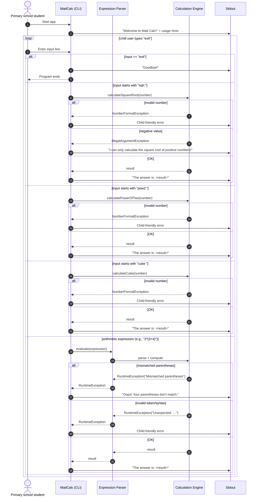

# Full-Stack Architecture: Mad Calc CLI (Java)

### 1. Overview

The Mad Calc is a command-line calculator application implemented in Java. It is designed to run directly from a laptop's terminal, providing users with basic and advanced mathematical operations through a simple CLI interface.

### 2. Technology Stack

- **Backend/Core:** Java (JDK 11+ recommended)
- **Frontend:** Command-Line Interface (CLI)
- **Build Tool:** Maven (preferred) or Gradle
- **Testing:** JUnit
- **Deployment:** Runs locally on macOS terminal

### 3. System Components

#### 3.1 CLI Interface

- Handles user input and output via standard input/output streams.
- Parses commands and forwards them to the calculation engine.

#### 3.2 Calculation Engine

- Core Java classes and methods implementing calculator logic (addition, subtraction, multiplication, division, etc.).
- Easily extensible for advanced operations (e.g., trigonometry, history, memory).

#### 3.3 Input/Output Handling

- Reads user commands from terminal.
- Displays results or error messages.

#### 3.4 (Optional) Persistence

- If required, can add a simple file-based history log for calculations.

### 4. Development & Deployment

- **Build:** Use Maven (`mvn clean package`) to build a runnable JAR.
- **Run:** Execute with `java -jar mad-calc.jar` or via `mvn exec:java`.
- **Platform:** macOS terminal (zsh/bash compatible).

### 5. Extensibility & Testing

- **Modular Design:** Each operation is a separate method/class for easy extension.
- **Testing:** JUnit test cases for all operations and input scenarios.
- **Error Handling:** Graceful handling of invalid input and exceptions.

### 6. User Interaction (Sequence Diagram)

Below is the typical interaction flow between a student and Mad Calc.



**Notes**

- This diagram reflects the current implementation where special commands (`sqrt`, `pow2`, `cube`) are handled as command prefixes, while general arithmetic expressions are handled by a recursive descent parser.
- All errors are converted into simple, child-friendly messages at the CLI boundary (standard output).

### 7. Example Usage

```sh
$ java -jar mad-calc.jar
Welcome to Mad Calc!
> 2 + 2
4
> sqrt 16
4
> exit
```

### 8. Future Enhancements

- Add support for command history and recall.
- Support for scripting or batch calculations.
- Optional GUI wrapper for desktop use.